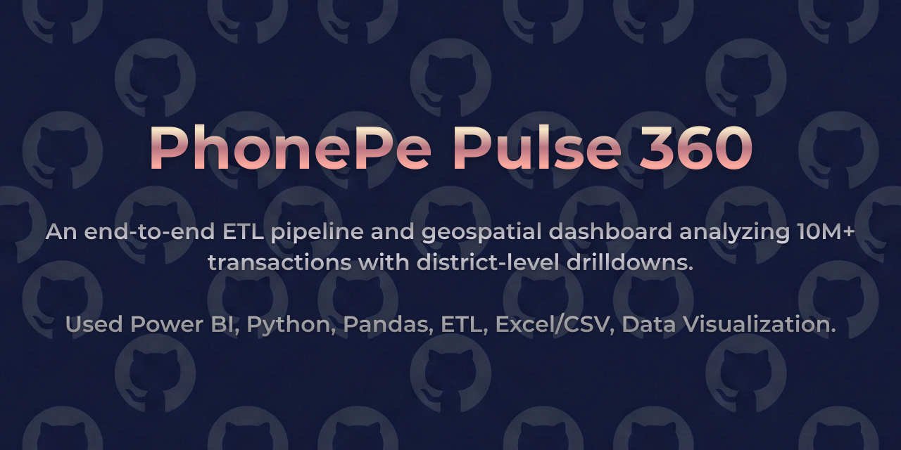
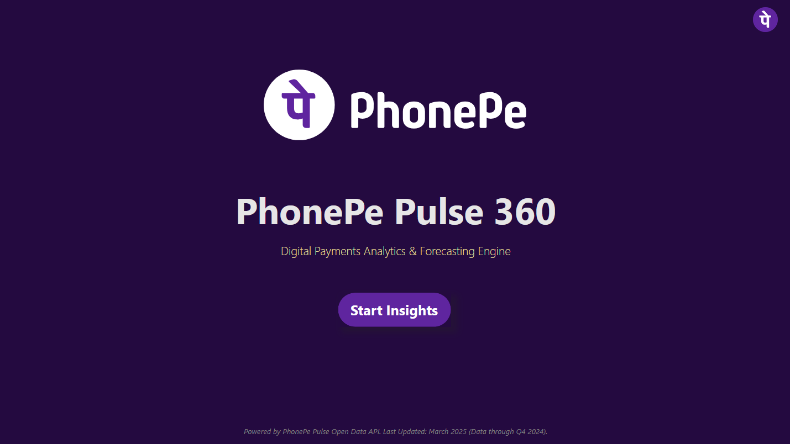
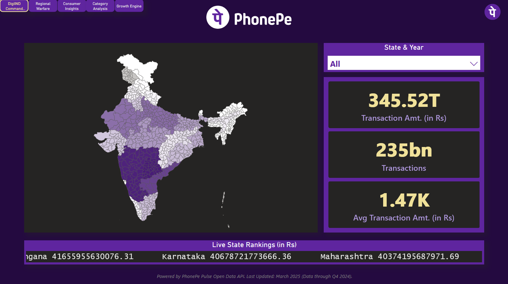
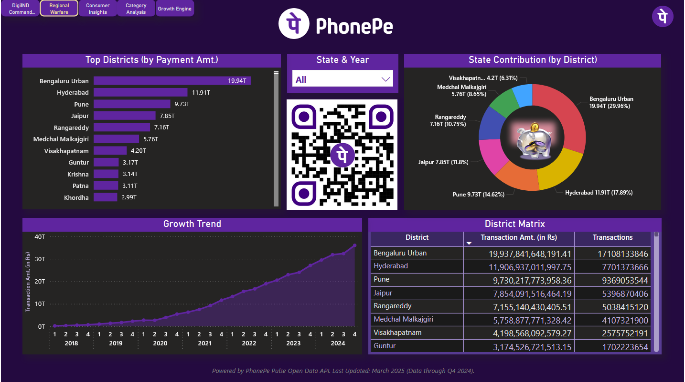
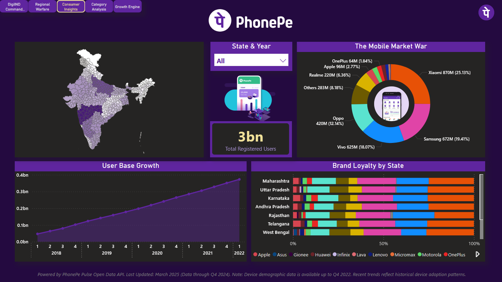
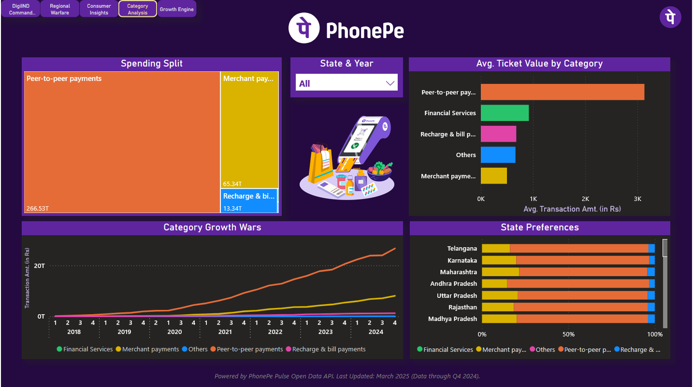
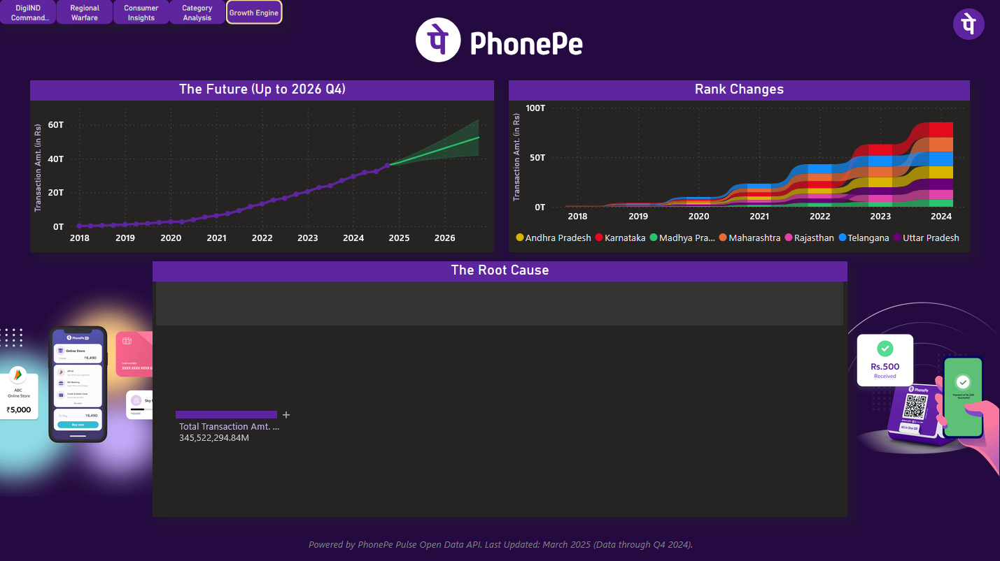

<p align="center">
  
</p>

# 📱 PhonePe Pulse 360: Geospatial Financial Analytics

### Digital Payments Analytics & Forecasting Engine (Power BI)

> State-wise, District-wise & Category-wise Digital Payments Intelligence  
> Built using Official PhonePe Pulse Open Data

## 📌 Project Overview

**PhonePe Pulse 360: Geospatial Financial Analytics** is an end-to-end fintech analytics solution built using the official PhonePe Pulse Open Data repository.

The dataset consisted of **5000+ deeply nested JSON files**, requiring a custom Python ETL pipeline before modeling in Power BI.

The dashboard delivers:

- State-wise transaction intelligence  
- District-level payment contribution  
- Consumer behavior analytics  
- Category growth tracking  
- Forecasting up to 2026 (Q4)  
- Root Cause Analysis using Decomposition Tree  

This project simulates a real-world **Digital Payments Intelligence System**, combining data engineering, BI modeling, geographic visualization, and forecasting.

## 📷 Dashboard Preview

### 🗺 Home


### 🗺 DigiIND Command Center


### 🏙 Regional Warfare


### 👥 Consumer Insights


### 🧾 Category Analysis


### 📈 Growth Engine



## 🎯 Problem Statement

India’s digital payments ecosystem is expanding rapidly.

This project answers:

- Which states drive the highest transaction value?
- How do districts contribute to overall state performance?
- Which transaction categories dominate spending?
- How fast is user adoption scaling?
- What is the projected future growth?
- What factors drive transaction shifts at the root level?

## 📊 Dashboard Structure

### 🗺 Digital Command Center
- India state-level transaction map  
- Total transaction amount  
- Transaction count  
- Average transaction value  
- Live state rankings  

### 🏙 Regional Analysis
- Top districts by payment amount  
- State contribution breakdown  
- Growth trend visualization  
- District performance matrix  

### 👥 Consumer Insights
- Registered user growth  
- Mobile brand market share  
- Brand loyalty by state  
- User expansion trends  

### 🧾 Category Analysis
- Spending split by transaction type  
- Category growth comparison  
- Average ticket size by category  
- State-level category preferences  

### 📈 Growth Engine
- Forecasting up to 2026 (Q4)  
- Rank change tracking  
- Decomposition Tree (Root Cause Analysis)  

## 🗺 Geographic Intelligence

The dashboard uses a **custom Shape Map (TopoJSON)** to enable:

- Dynamic state highlighting  
- Interactive regional zooming  
- Conditional color scaling  
- Context-aware filtering  
- Default national view with drill-down capability  

This enhances geographic clarity and analytical precision.

## ⚙️ Data Engineering Approach

The PhonePe Pulse dataset was not provided as flat CSV files.

Instead, it consisted of hierarchical JSON files structured by:

- State  
- Year  
- Quarter  
- Transaction Type  
- User Metrics  

A custom Python ETL pipeline was developed to:

- Recursively parse nested JSON files  
- Normalize hierarchical structures  
- Extract transaction and user metrics  
- Convert into structured CSV datasets  
- Prepare for Star Schema modeling  

All ETL logic is documented inside:

```
Scripts/PhonePe_Extraction.ipynb
```

## 🛠 Tools & Technologies

- Python (JSON Parsing & ETL)
- Pandas
- Power BI Desktop
- Power Query
- DAX
- Star Schema Modeling
- Shape Map (TopoJSON)
- Forecasting
- Decomposition Tree

## 🧩 Data Modeling Approach

The dashboard follows a **Star Schema design**.

### Fact Tables
- Aggregated Transactions  
- User Registrations  
- Category-Level Transactions  

### Dimension Tables
- State  
- District  
- Year  
- Quarter  
- Transaction Type  

A calculated `Transaction Date` column was created using Year & Quarter:

```DAX
Transaction Date = DATE([Year], ([Quarter] * 3) - 2, 1)
```

The model is optimized for:

- Cross-filtering  
- Drill-down analytics  
- Forecasting  
- Decomposition Tree exploration  

## 📂 Data Source

### PhonePe Pulse Open Data  
Official Repository:  
https://github.com/PhonePe/pulse#readme  

> Raw JSON files are not redistributed in this repository.

## 📊 Key Metrics Implemented

- Total Transaction Amount  
- Transaction Count  
- Average Transaction Value  
- Registered Users  
- Category Growth  
- Forecasted Growth  
- Root Cause Breakdown  

## 💡 Business Value

This dashboard supports:

- Fintech performance benchmarking  
- State-level digital adoption analysis  
- Category growth identification  
- Regional investment prioritization  
- User expansion monitoring  
- Transaction forecasting & risk assessment  

It demonstrates real-world **Digital Payments Intelligence & Growth Analytics capability**.

## 📁 Repository Structure
- Assets contain Dashboard Visuals, Complete Walkthrough PDF and Repository Banner / Social Media Preview Image.
- Datasets contain Dataset References (no raw data included).
- Scripts contain all the ETL logic and DAX Documentation.
- *PhonePe Pulse 360.pbix* is the Complete Interactive Power BI Dashboard.

```text
PhonePe-Pulse-360-Geospatial-Financial-Analytics/
│
├── Assets/        
│
├── Datasets/      
│   └── Data-Sources.md
│
├── Scripts/      
│   ├── PhonePe_Extraction.ipynb
│   └── DAX-Measures.md
│
├── PhonePe Pulse 360.pbix
│
└── README.md
```

## 👤 Author

**Aryan Deshpande**  
> Aspiring Data Analyst
